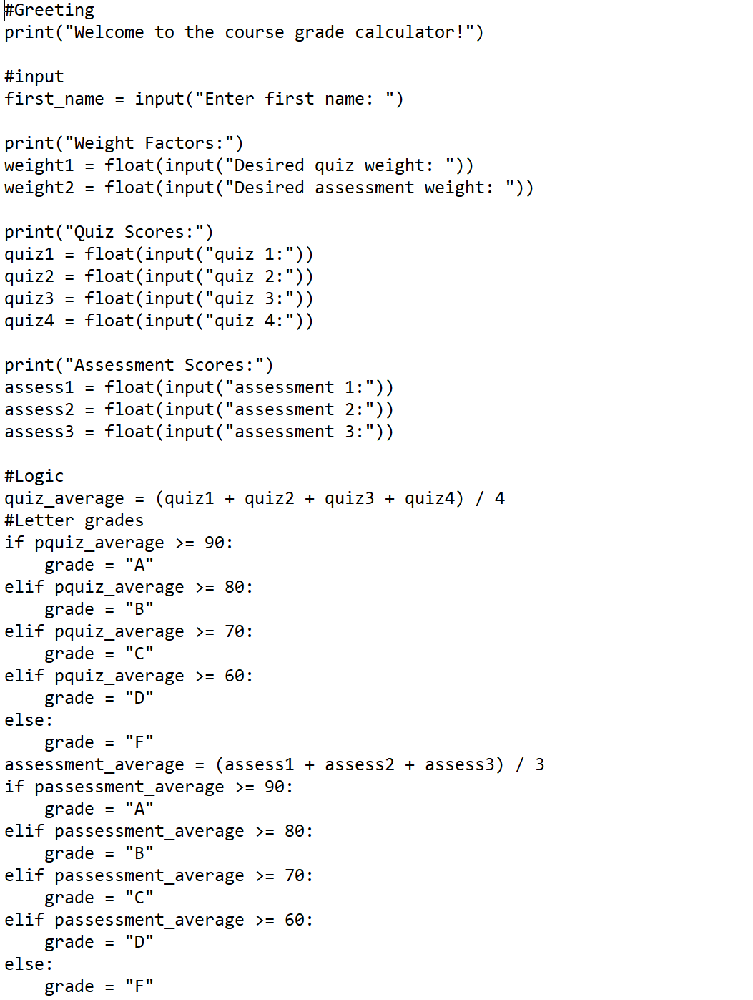
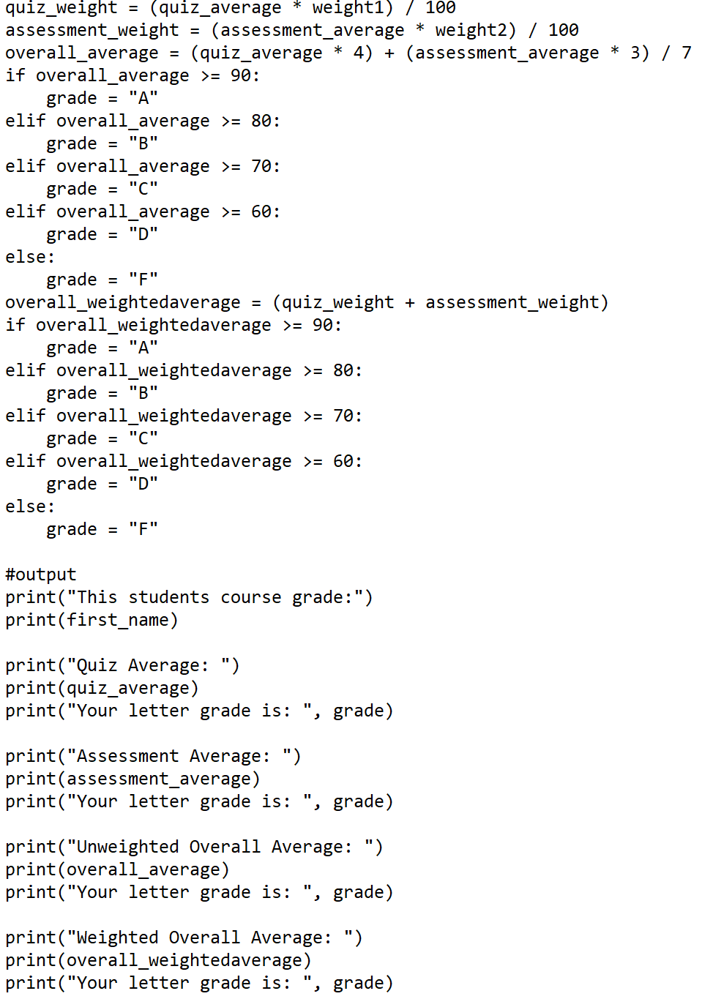
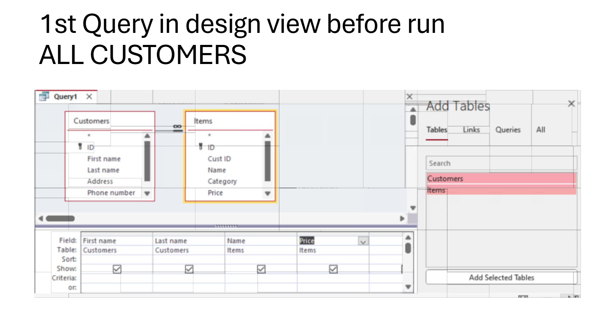
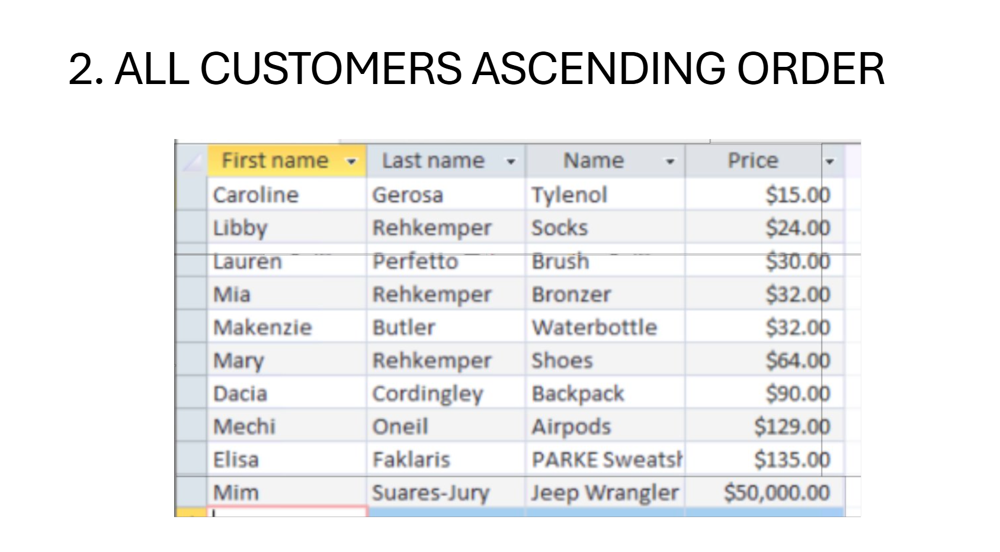
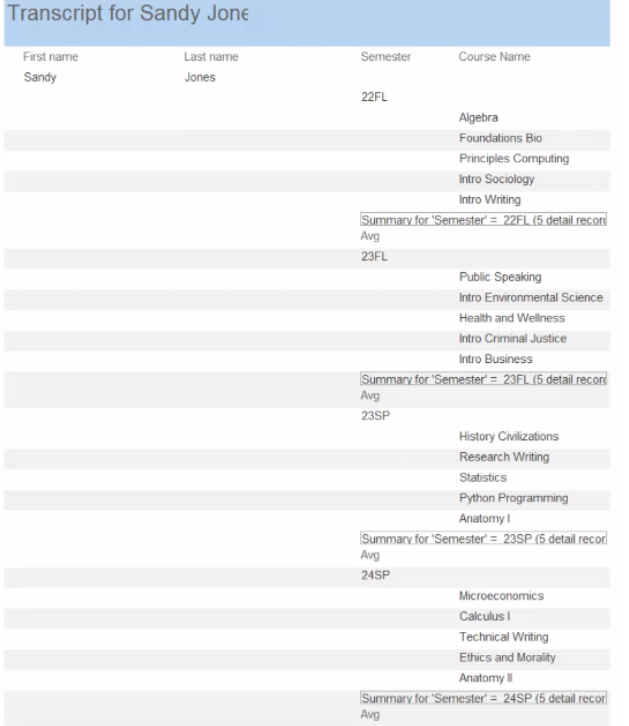
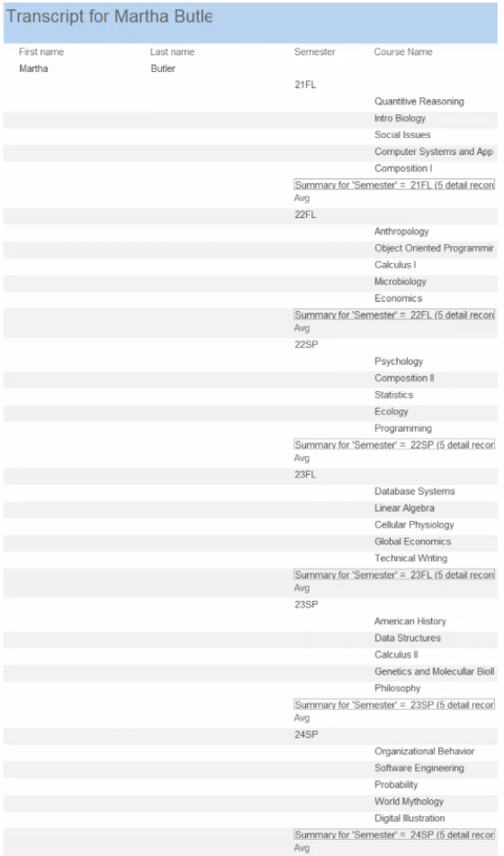

# Mary-s-Portfolio
This is my CS105 Portfolio!

# Mary Cate Rehkemper
Contact Info: 
410-816-6008, 
mcrehkemper@loyola.edu

### About Me
Hello! I am an experienced occupational therapist and computer science professional with over 2 years of proven expertise in pediatrics and coding. 

With skills in graphing in Microsoft Excel, coding in Python, relating tables in Microsoft Access, and creating entire portfolio's for job applications, I am able to stay organized and work efficiently on my computer when updating my workload day to day. I am adept at using Microsoft Excel, Python in JDoodle, Microsoft Access, and GitHub.

My hardworking skill set, commitment to making a difference in the world, and passion for teamwork in making someone's life easier and happier help me to be a great pediatric occupational therapist and computer science specialist. In my spare time, I like to play lacrosse and spend time with my family and friends. 

### Education
**BSc in Bio Psych**  
Loyola University Maryland

#### Project 1: Python Course Grade Calculator

[link to jdoodle](/www.jdoodle.com/ga/qzslxEHfkP2zf8kUaIvfnw%3D%3D)

#### Initial project idea: 
This Course Grade Calculator allows students to put in their desired weights for 4 quizzes and 2 assesments (assignment weights must add up to 100), then they can insert their 4 quiz grades and 2 assesment grades to figure out their final letter grade in the course. This is important for a student to be able to figure out, so they can understand what work they need to do to obe able to finish with their desired grade. 

#### Tools I used: 
I coded in Python3 on Jdoodle.  

#### Challenges I faced:
COding in Python was overall just super difficult because if you make one mistake, the entire project will not run and there will be an error. It was a challenge debugging the code when I would make a mistake, because it is such a long code it took a long time. I overcame these challenges by just taking my time and not rushing. 

#### Other Resources: 
I collaborated with my friend Mim who is also taking this class. Together, we both got through this project and our code works perfect!

#### Result:
I set out to be able to see my final letter grade in any course that I am taking, and was able to successfully see that grade! 

#### Summary:
This is my Course Grade Calculator that I coded through Python! I struggled a lot with the Python module, but I chose to display this project because once I understood Python, I was super proud of myself and can understand why people find coding useful in the real world. This Course Grade Calculator allows someone to enter their desires quiz and assesment weights adding up to 100, and then enter their 4 quiz scores and assesment scores to add up their final grade overall. I found this very useful and tried to use it to calculate my current course grades everall! The biggest obstacle I came across was connecting the overall grade letter with the overall percentage of the grade. Even hough the Python module was a challenge for me, by the end of it I really got the hang of it and found it kind of fun to code!

***
#### Project 2: Microsoft Access Queries

#### Initial project idea: 
This is a quary that I made comparing items that 10 of my friends bought, placed in ascending order of who bought the least expensive item to the most expensive. CReating quaries was something I wanted to learn how to do, because it is an important skill to be able to compare two tables together. 

#### Tools I used: 
I used Microsoft Access. 

#### Challenges I faced:
A challenge I came across was when making quaries, I kept linking the wrong things in the two separate tables together so my connection between the two tables were messed up. Aftert I linked the student ID of the students name in one table to the specific item they bought in the second table, my quary worked awesome. 

#### Other Resources: 
I used the resources Mr. John sent us on Moodle, and also collaborated with my friend Mim who is also in the class.  

#### Result:
I set out to link two tables together and I successfully did that by making a quary. 

#### Summary:
This is my Quary comparing customers in ascending order that I created through Microsoft Access! I loved this Microsoft Access module, and I can see myself using this in the real world. In this project, I connected two tables by using a quary. I connected the two tables by the customer and their Student ID. I struggled a little bit connecting the correct piece of information between the two tables, but once I connected the right thing it worked perfectly. This Microsoft Access module was my favorite module!

***
#### Project 3: Microsoft Access Project Transcripts

#### Initial project idea: 
This Microsoft Access Project Transcript is a transcript of grades for two made up students. This shows their report card and averaged GPA. This is important for teachers to be able to do when sending out report cards at the end of the year. 

#### Tools I used: 
I used Microsoft Access. 

#### Challenges I faced:
I faced challenges in my Microsoft Access when averaging the GPA and having that specific number print out on to the final transcript. (I think this was just a problem on my Microsoft Access and so I emailed Mr. John and he said not to worry about it.)

#### Other Resources: 
I used the resources on Moodle for this module, and also worked with my friend Mim who is also in the class. 

#### Result:
I set out to print out 2 separate project transcripts for 2 made up students and their GPA's, and I printed out the professional transcripts but could not figure out how to print the average GPA on the final transcript. 

#### Summary:
These are two students project transcripts that I created through Microsoft Access! These grades consist of their fall and spring courses. The grades add up to their average GPA. I struggled getting the average of their GPA and that being put on the actual transcript, but it turned out to just be something wrong with my own Microsoft Access. I really enjoyed this project because it was cool to create a transcript that looked exactly the same to what I recieved in elementary and middle school. I learned to appreciate using Microsoft Access in the real world, because I can see how teachers use this. 

